# 机器人与人工智能导论复习提纲

## 前言

​        《机器人与人工智能导论》是控制学院为机器人工程专业的同学们开设的一门专业基础课程。这门课主要分别由王酉老师、朱秋国老师、张建明老师讲解三个部分，内容较多且较为杂乱，需要记忆的东西较多。23-24春夏的考试周前，我整理了一篇《机器人与人工智能导论提纲与历年卷》，受到了很多同学的好评，也收到了许多建议。当时是使用word排版的，色彩过于丰富，不易识别重点，且结构相对混乱。且由于时间所限部分明确那年不考的内容没有整理。为了进一步方便同学们的复习与背诵，我于24-25秋冬的寒假重新整理成markdown的格式，希望能够在之后帮到机器人的一代代同学们！当然也有很多不足之处，还请多批评指正！在此感谢@博格达 对内容的进一步补充和完善，以及对我继续完成这篇整理的鼓励；也感谢@FrankG 的模版。历年卷部分来自各位前辈的回忆，也希望各位学弟学妹能够传递下去！

​          需要提醒大家的是，这门课的最后，三位老师均会发给大家复习ppt，且每年可能有所变化，用以划定当年考试的范围（也就是说复习ppt以外的都不考），而本提纲整理了几乎所有课上ppt看上去很可能的内容，因此请大家注意辨别，以当年发布的复习课ppt为准。预祝大家取得优异的成绩！

​                                                                                                                                                                                                     Colamentos
​                                                                                                                                                                                            2025.1.11于林海雪原

## Part 1 王酉老师部分

### Lesson 1:绪论

1.机器人从应用角度分为**<u>工业机器人</u>**（**<u>工业制造、工件运输</u>**）和**<u>服务机器人</u>**（**<u>军事侦察、微创手术、家庭清洁、外空探测</u>**）；机器人从运动角度分类：**<u>轮式、履带、足式</u>**等。

> *无人驾驶汽车：不能直接说是工业/服务机器人，得看运货还是运人

2.机器人的本质：机器人是一种**<u>人造</u>**的机器，具有**<u>人类</u>**的特性（两个维度：**<u>体能、智能</u>** 或**<u>能量、信息</u>**）

3.能量传递系统？信息传递系统？（可考简答，也是设计题的核心思想）

<table frame=void>	<!--用了
进行封装-->
	<tr>
        <td>

	<!--每个格子内是图片加标题-->
        	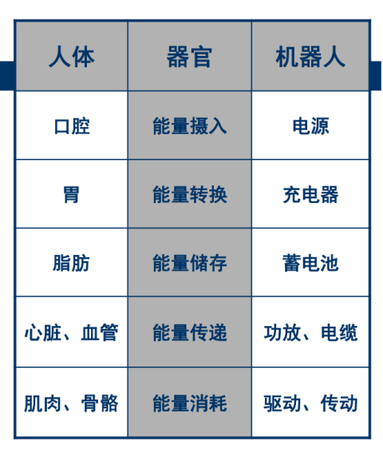	<!--高度设置-->
             
            能量传递系统
        

</td>    
     	<td>

	<!--第二张图片-->
    		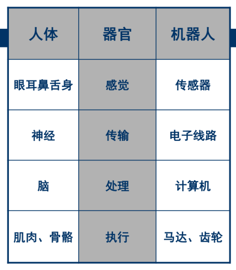	
             
            信息传递系统
        

</td>
	</tr>
</table>

4.自主机器人的一般架构：

<table frame=void>
 <tr>
 <td>
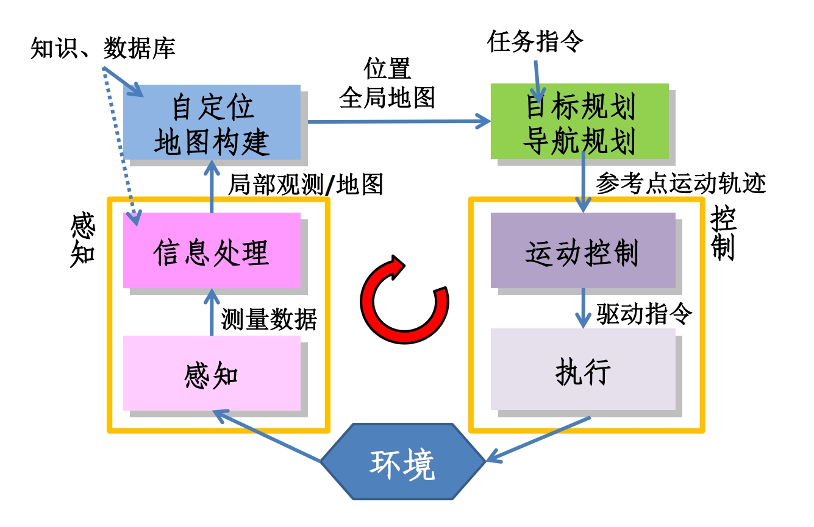
</td>
 </tr>
</table>

### Lesson 2:嵌入式系统

5.冯诺依曼体系结构是指**<u>计算机的硬件组成结构</u>**。其主要组成部分如下（如果强调要画图，则必须要画图）

<table frame=void>
 <tr>
 <td>
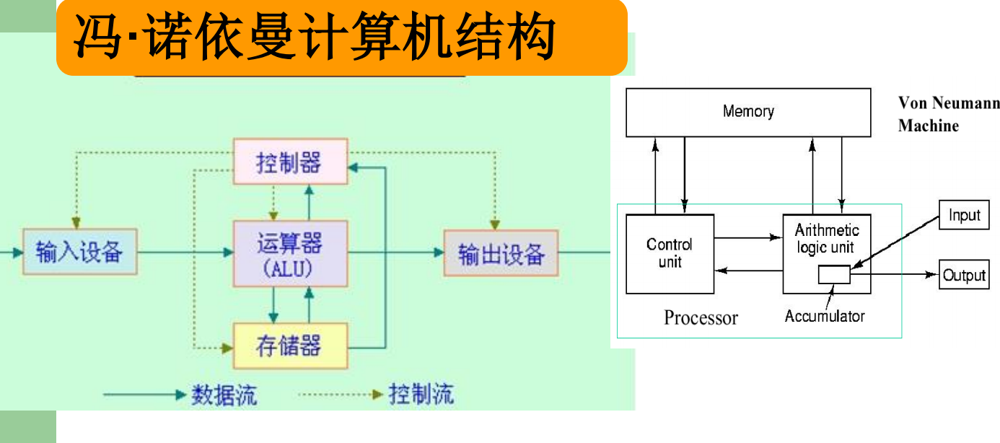
</td>
 </tr>
</table>

6.Arduino 是一个能够用来**<u>感应</u>**和**<u>控制</u>**现实物理世界的一套工具，是一个打包后的**<u>平台</u>**（而非仅仅是芯片）
   ·两个函数：**<u>setup</u>**（初始化）和**<u>loop</u>**（循环）

7.**<u>PWM脉宽调制</u>**：用改变电机电枢电压接通与断开的时间占空比来控制电机转速的方法

> 例：如何实现让LED灯不闪烁，但是亮度只有正常亮度的20%，请写出关键指令: 
>
> ​	digitalWrite(LED，HIGH);
>
> ​	delay(2);
>
> ​	digitalWrite(LED,LOW);
>
> ​	delay(8);

8.机器人控制方法举例：位置控制、速度控制、加速度控制、力控制、力位混合控制等

### Lesson 3:传感器

9.传感器的定义：用于**<u>定量</u>**感知环境**<u>特定物质属性</u>**的电子、机械、化学设备，并能够把各种**<u>物理量和化学量</u>**等精确地变换为**<u>电信号</u>**，再经由电子电路或计算机进行分析与处理，从而对这些量进行检测。

> *接近觉：**<u>人类所没有的功能</u>**
>
> *移动机器人的传感器，记住大体架构，需要会迁移

10.传感器分为**<u>内部</u>**和**<u>外部</u>**两大类；
①内部传感器控制测量机器人**<u>自身状态</u>**，常用于**<u>底层运动控制</u>**；
②外部传感器测量机器人**<u>所处环境</u>**，部分用于**<u>底层运动控制</u>**，部分用于**<u>上层运动规划</u>**。

<table frame=void>	<!--用了
进行封装-->
	<tr>
        <td>

	<!--每个格子内是图片加标题-->
        	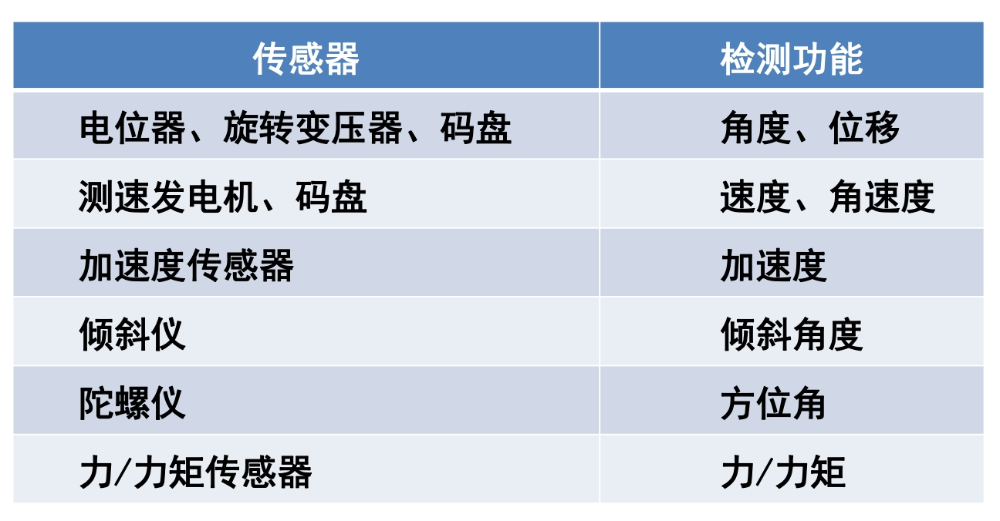	<!--高度设置-->
             
            内部传感器
        

</td>    
     	<td>

	<!--第二张图片-->
    		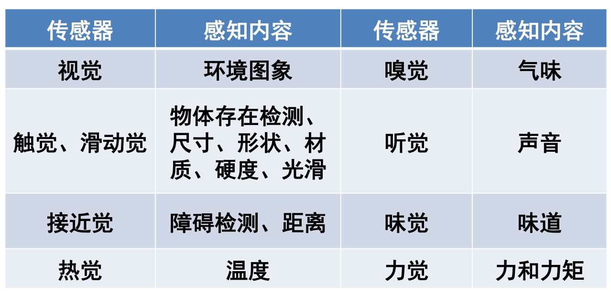	
             
            外部传感器
        

</td>
	</tr>
</table>

> （1）电位器：
>
> ①原理：**<u>滑动片靠近或接触电阻丝取电信号，将位移转化为电阻变化，进而变成电流与电压的变化</u>**
> ②分类：旋转式（测量**<u>角位移</u>**）/直线式（测量**<u>线位移</u>**），测量**<u>绝对位置</u>**
> ③使用方式：单独使用/和其他传感器(如编码器)一起使用；
> 用**<u>电位器</u>**检测起始位置/用**<u>编码器</u>**检测关节和连杆的当前位置。
>
> 
>
> （2）速度传感器（编码器）：
>
> ①分类：根据测量介质分为光电码盘和磁编码器；根据测量结果分为绝对式和增量式
>
> <table frame=void>
> <tr>
> <td>
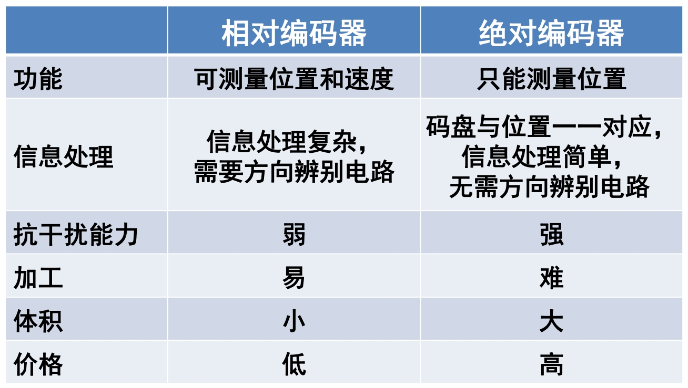                alt="None"
>                height="200"/>
</td>
> </tr>
> </table>
>
> ①光电码盘原理：**<u>切割光/磁，通过脉冲计数计算旋转角度</u>**
> ②利用编码器测量速度的两种方法（混合测速法）：
> （记周）测量相邻**<u>脉冲时间间隔</u>**，速度越**<u>慢</u>**越精确
> （记频）统计指定时间内**<u>脉冲信号数量</u>**，速度越**<u>快</u>**越精确
>
> 
>
> （3）加速度传感器：
>
> ①核心：$F=ma$
> ②原理：利用加速度造成某个介质**<u>产生变形</u>**，通过测量其**<u>变形量</u>**并用相关电路转化成**<u>电压</u>**输出
> ③举例：**<u>压电晶体</u>**
>
> 
>
> （4）方位角传感器
> ①作用：用于测量机器人的**<u>方向</u>**和**<u>倾角</u>**，可进行机器人位姿估计
> ②举例： 指南针（缺点：**易受其他磁性物质和人类环境的干扰**）、陀螺仪、倾角仪
>
> 
>
> （5）角速度传感器（陀螺仪）
>
> ①分类：机械陀螺仪、光纤陀螺仪
> ②MEMS陀螺仪：MEMS陀螺仪利用**<u>科里奥利力</u>**（旋转物体在径向运动时所受到的切向力），**<u>积分</u>**计算出角速度、角度等，即**<u>测量加速度（科里奥利力）->积分 ->获得角度</u>**，有**<u>三轴加速度、三轴角速度、三轴角度</u>**
>
> 
>
> （6）力觉传感器
>
> ①分类：压阻式（半导体压阻效应）、压电式（压电效应）、阻容式（电容机理）
>
> 
>
> （7）力矩传感器
>
> ①原理：当力矩作用在弹性轴上，轴会产生扭曲变形，存在剪切应变和应力
> ②应用：安装在关节驱动器上，用于测量驱动器输出的力和力矩，实现关节力控制；安装在末端执行器上，称腕力传感器；安装在手爪指关节上，称指力传感器。
> ③基于位置传感器和力力矩传感器的机器人控制：
>
> <table frame=void>
> <tr>
> <td>
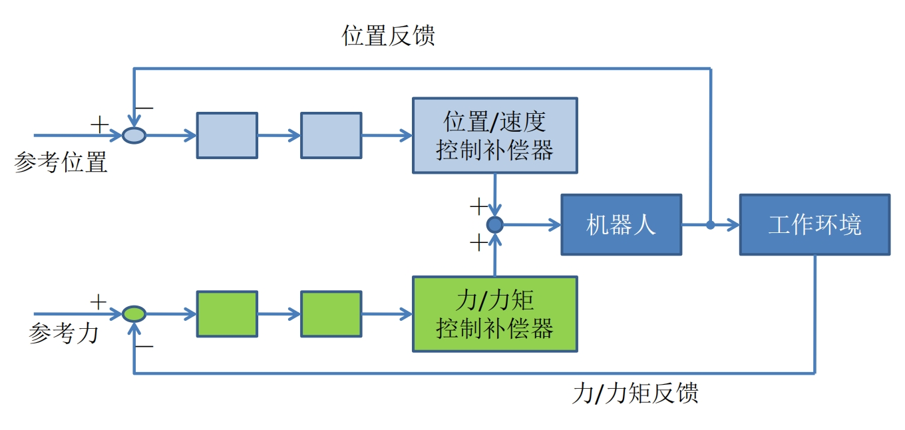                alt="None"
>                height="220"/>
</td>
> </tr>
> </table>
>
> 
>
> （8）触觉传感器
> ①定义：测量解释接触觉、压觉或滑觉的传感器
> ②作用：确定接触的发生，提供接触的信息，如形状、尺寸和材质等。
>
> 
>
> （9）超声传感器
>
> ①原理：利用**<u>压电传感器</u>**生成声波，采用测量**<u>传输时间</u>**法测距
> ②模式：**<u>对置模式</u>**/**<u>回波模式</u>**
>
> 
>
> （10）激光传感器
>
> ①原理：同上
> ②主要测距方法：**<u>三角法</u>**、**<u>时飞法</u>**（TOF）、**<u>相位法</u>**
> 三角法：比较落后，位移转换为位移
> 时飞法（直接延迟时间测量法）：由于光速快，对时钟精度要求高→修正（**<u>间接相位时间测量法</u>**）：发射器发射一个连续波。用具有**<u>不同频率的sin信号</u>**调制所携带信号的波长。比较反射信号与所发送信号之间的**<u>相位差</u>**
> ③超声传感器和激光传感器区别/激光传感器为什么好：
> 问题1：**<u>声波速度慢，降低了感知速率；声波束按锥形方式传播,，空间分辨率低</u>**；
> 问题2：**<u>软的物体表面将吸收大部分声音能量，光滑的物体表面将形成镜面反射</u>**。
>
> 
>
> （11）视觉传感器
>
> ①原理：通过光学摄像机或红外、激光、超声、X射线对周围场景或物体进行探测成像

11.传感器的特性：分为**<u>静态特性</u>**和**<u>动态特性</u>**；前者要求<u>**输出相对于输入保持一定的对应关系**</u>；后者也叫<u>**响应特性**</u>，要检测的输入信号是**<u>随时间而变化</u>**的，则传感器应能跟踪输入信号的变化。

12.主要静态特性举例：灵敏度、信噪比、线性、时滞、稳定性、精度。

13.传感器的发展趋势：微小化、仿生化、柔性化、多信息融合

14.机器视觉：例如深度学习算法YOLO
应用：人脸识别、无人驾驶、医学图像诊断、产品质量识别

> 小寄巧：冯诺依曼框图怎么画？
>
> 包含两个维度：信息与能量	
> →信息：主要是输入（传感器等）、MCU（包括了控制、运算、存储）、输出（执行机构等等）	
> →能量：为整个系统供能，可以框起来写外面：电源；连线即表示电缆
>
> <table frame=void>
>  <tr>
>  <td>
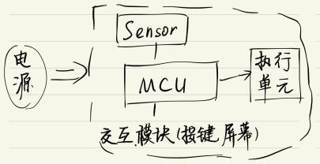                   alt="None"
>                   height="220"/>
</td>
>  </tr>
> </table>

## Part 2 朱秋国老师部分

### Lesson 4:机器人驱动原理概述

1.机器人的主要特征：感知、决策、运动、交互。

2.驱动方式

（1）电机驱动：
①优点：控制调节简单、稳定性较好；
②缺点：力矩小、刚度低，常常需要配合减速器使用。
③电机驱动最常用的驱动方式是**<u>有刷电机H桥驱动</u>**，其中4个二极管的作用是**<u>防止反向电压</u>**，直流有刷电机控制A、B两相的输入：
A为正，B为负的时候，电机进行正转；
A为负，B为正的时候，电机进行反转；A、B都为正的时候，电机停止转动；
④L298芯片是双H桥驱动器，可以驱动两个直流电机。
⑤基本控制方式有：开环伺服系统、闭环伺服系统和半闭环伺服系统。
⑥直流电机可以输出**<u>力矩和速度</u>**，如小车的直线运动、转弯等；舵机用于**<u>角度、位置</u>**伺服，如机械手转动；PWM波（占空比可变的方波）控制。
→直流有刷电机由**<u>磁极、电枢绕组、电刷和换向片</u>**组成。
→无刷直流电机由**<u>电机本体、位置传感器、电子换向电路</u>**三大部分组成。
	1）电机主体由**<u>主定子、主转子</u>**组成。主转子是永久磁铁，主定子是电枢。
	2）一般而言，无刷电机的绕组有**<u>星形联结</u>**方式和**<u>三角联结</u>**方式，而三相星形联结（Y型）的**<u>二二导通方式</u>**最为常见。
	3）位置传感器包括光电编码器、霍尔传感器；一般在电机的不同位置上装**<u>三个霍尔传感器</u>**，就可测出转子的位置。

<table frame=void>	<!--用了
进行封装-->
	<tr>
        <td>

	<!--每个格子内是图片加标题-->
        	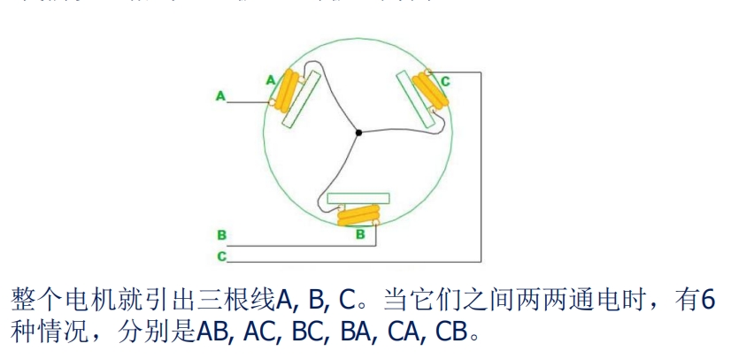	<!--高度设置-->
             
            以三相3绕组2极（1对极）为例
        

</td>    
     	<td>

	<!--第二张图片-->
    		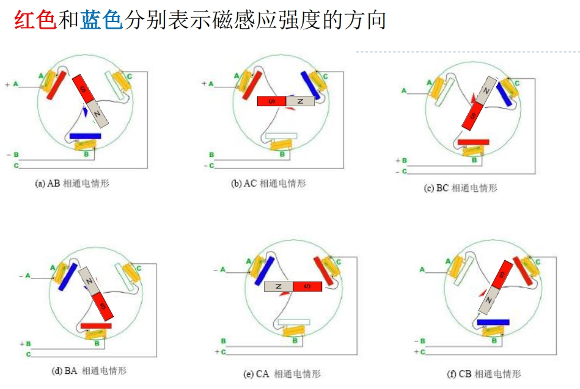	
             
            换相只与转子位置有关，与速度无关
        

</td>
	</tr>
</table>

​         采用9绕组6极，而不是6绕组6极原因：为了防止定子的齿与转子的磁钢相吸而对齐，产生类似步进电机的效果，此情况下转矩会产生很大波动。

⑦三个重要物理量：电枢电动势$E_a$、电磁转矩$T$和电磁功率$P$；**转速与感应电动势成正比**，**力矩与电流大小成正比**。
$$
E_a=K_en\\
T=K_mI\\
P=E_a \cdot I=T\cdot\omega
$$
→检查电机是否烧坏，可以通过测量电机绕阻的值是否正常来判断。
→斜率(速度/转矩常数)越小，说明电机的刚性越好，越“硬”。斜率是电机本身决定的，与端电压和速度无关。

⑧负载的转动惯量折合到主动轴上时，从动轴上的转动惯量和阻尼系数都要除于传动比的平方，负载转矩除于传动比。⑨脉冲宽度调制（PWM）：**<u>用改变电机电枢电压接通与断开的时间占空比来控制电机转速的方法</u>**。
$$
v_d=v_{max}\cdot D
\\其中D为占空比，即下图中的\frac{t_1}{T}
$$

<table frame=void>
 <tr>
 <td>
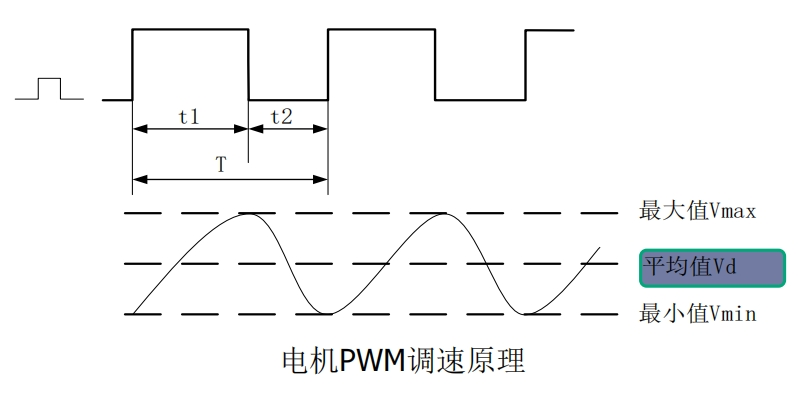
</td>
 </tr>
</table>

（2）气压驱动：
①优点：气源获得方便、成本低、动作快；
②缺点：输出功率小，体积大。一般而言，其工作噪声较大、控制精度较差；
③组成：气缸、气阀、管路。
④**气动驱动系统**包括：**<u>气压发生装置、辅助元件、控制元件和执行元件</u>**，方向控制回路包括单作用气缸换向回路 、双作用气缸换向回路

<table frame=void>	<!--用了
进行封装-->
	<tr>
        <td>

	<!--每个格子内是图片加标题-->
        	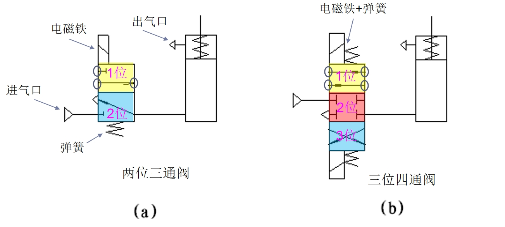	<!--高度设置-->
             
        

</td>    
     	<td>

	<!--第二张图片-->
    		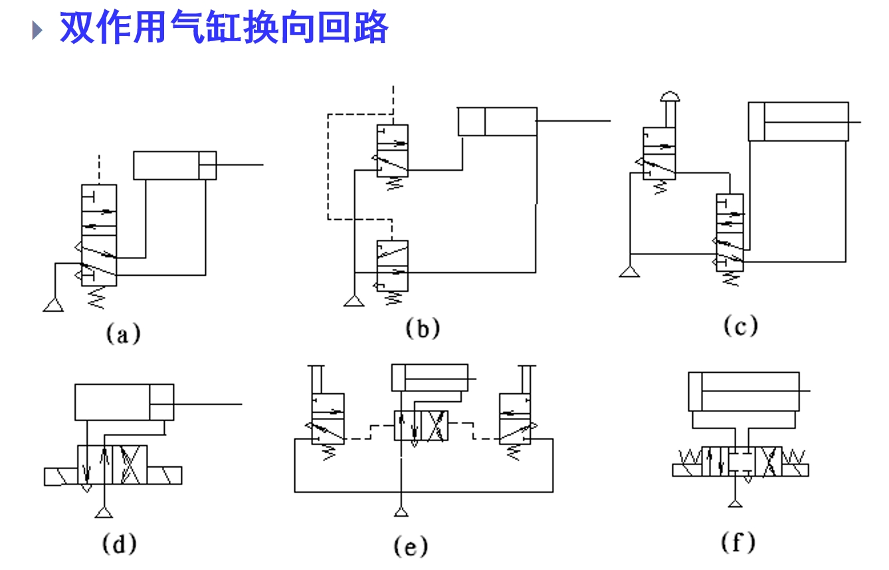	
             
        

</td>
	</tr>
</table>

> 小寄巧：
>
> **Q:判断是单作用还是双作用？**
>
> 1.本质：活塞一端自由、一端连通路→单作用；两端均连通路→双作用
> 2.直接看活塞有没有弹簧，有弹簧则为单，反之为双
> 3.三通一般是单，四通、五通一般是双
>
>  
>
> **Q:判断几位几通（重要）？**
>
> 位（位置状态）：有几个形如的块，就有几位
> 通：取任意一个如上所示的块，有一个箭头加2通，一个小“T”加1通

（3）液压驱动：
①优点：重量轻、尺寸小、动作平稳、快速性好、产生的力/力矩非常大；
②缺点：易漏油、维护困难；不确定性和非线性因素多，控制和校正不如电气式方便；
③组成：液压缸、液压马达、阀
④液压驱动系统包括：液压源、伺服阀、传感器、执行机构；原理：根据Pascal’s LAW， 液压压力可以成倍增大

<table frame=void>
 <tr>
 <td>
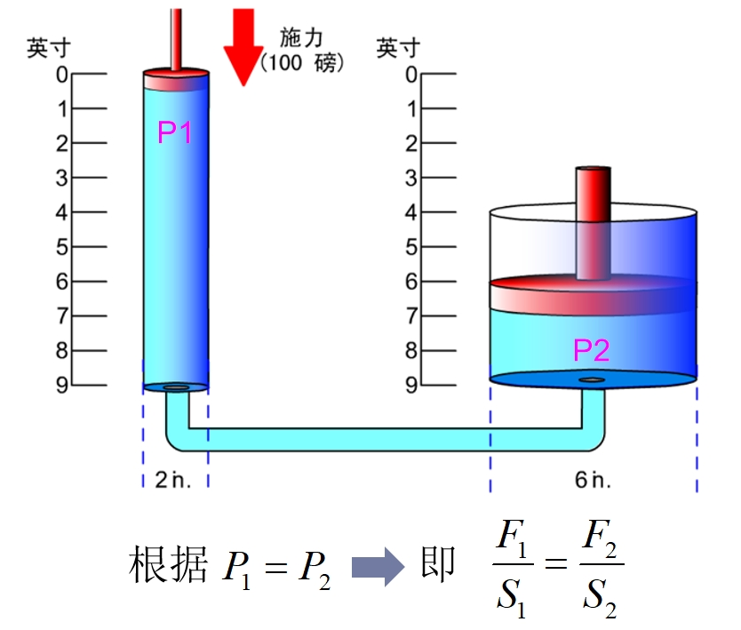
</td>
 </tr>
</table>

（4）新型驱动（如形状记忆合金→软体机器人）
磁流变液、基于介质电致变形的软体机器、气动软体机器人

3.模拟舵机（闭环控制）

①原理图

<table frame=void>
 <tr>
 <td>
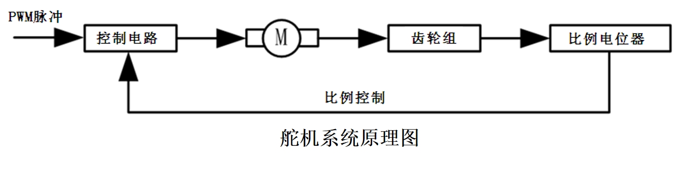
</td>
 </tr>
</table>

②标准舵机有三条控制线，分别为电源线、地线和控制线。控制线连接到控制芯片上。
③舵机转动角度由**<u>PWM（脉冲宽度调制）信号的占空比</u>**来实现；PWM周期为20ms，脉宽分布在0.5～2.5ms之间；不同脉宽对应不同转角位置（以180°为例：0.5ms= -90°；1.5ms = 0°；2.5ms= 90°）。
④电机+减速器：改变运动速度、改变运动力量、改变运动方向

### Lesson 5:机器人设计与传动

4.在传动机构中，由旋转运动变成直线运动的机构举例：**<u>齿轮齿条、曲柄滑块、凸轮、皮带、螺丝、滚珠丝杠、链条</u>**

5.机器人机构三部分：**<u>执行机构、传动机构、支撑/导向机构</u>**

> 传动机构的性能要求
>
> 1、转动惯量：尽量小。
> 2、刚度：伺服系统动力损失小。
> 3、阻尼：共振区域阻尼越大越好;远离共振区域阻尼越小越好。
> 其他要求：摩擦小、抗振性好、传动间隙小等。

6.减速比：也即**<u>传动比</u>**。指减速机构**<u>输入速度</u>**与**<u>输出速度</u>**之比，用“i”表示。即，**<u>i =输入速度/输出速度</u>**，并使**<u>输出力/力矩变为原来的i倍</u>**

> *减速机构作用：①**<u>减小速度</u>**②**<u>增大力矩</u>**
>
> 例：电机输入减速箱的速度1000n/min，输出速度10n/min，则减速比 i =1000/10=100
> 如电机输出力矩为$T_{in}$=0.1Nm，则输出力矩为$T_{out}=i\cdot T_{in}$=0.1Nm*100=10Nm

7.刚体的自由度：刚体本身具有可独立运动方向的数目。若$l$为连杆数（包括基座），$n$为关节总数，$f_i$为第$i$个关节的自由度数：
$$
F=6(l-n-1)+\sum\limits^n_{i=1}f_i
$$
对于平面机构。其自由物体是三个自由度，上述公式中6改为3，即
$$
F=3(l-n-1)+\sum\limits^n_{i=1}f_i
$$
8.齿轮

①优点：传动比较准确，效率高，结构紧凑，工作可靠，寿命长。
②模数$m$：$p_i/\pi$ （模数越大，齿厚就越大，齿轮的承载能力就越高；**<u>欲使两齿轮正确啮合，两轮的模数必须相等</u>**）
③分度圆：规定分度圆上的<u>**模数和压力角**</u>为标准值；分度圆又称节圆；国标压力角的标准值为**<u>20°</u>**；**<u>分度圆直径$d=mz$</u>**
④定常传动比：对齿轮传动的基本要求是保证瞬时传动比$i_{12}=\frac{\omega_1}{\omega_2}=const$；

9.齿轮轮系

①传动比：
$$
i_{首末}=\frac{\omega_首}{\omega_末}=\frac{z_末}{z_首}
$$
②转向关系：外啮合（**<u>方向相反</u>**），内啮合（<u>**方向相同**</u>）

<table frame=void>
 <tr>
 <td>
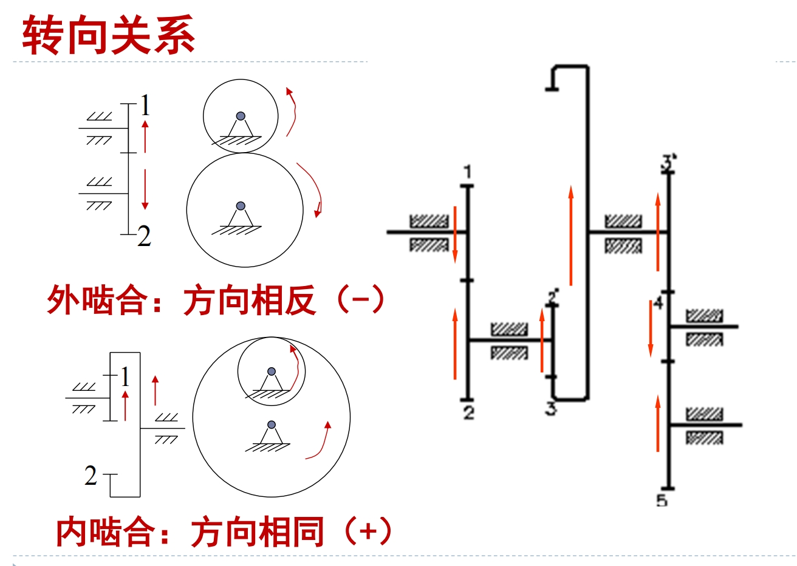
</td>
 </tr>
</table>

> 小寄巧
>
> **Q:判断旋转方向的传导？**
>
> 严格竖直同一列的转动方向相反，否则方向相同。
>
> **<u>Q:计算减速比？</u>**
>
> ①减速比一定大于1
> ②1到2的减速比即为“齿数2/齿数1”，同向取正，反向取负；
> ③多个齿轮拼接，当没有出现“同一轴上有两个齿轮的情况”，减速比直接相乘，即为“最后一个齿轮的齿数/第一个齿轮的齿数”，同向取正，反向取负；
>
> 例如上图中的从左到右数第二个齿轮，此处2齿轮同轴有两个齿轮，因此$z_2$与$z_2'$是两个不同的齿数，无法直接约分；3齿轮同理：
>
> <table frame=void>
>  <tr>
>  <td>
                   alt="None"
>                   height="380"/>
</td>
>  </tr>
> </table>

10.周转轮系：

<table frame=void>	<!--用了
进行封装-->
	<tr>
        <td>

	<!--每个格子内是图片加标题-->
        	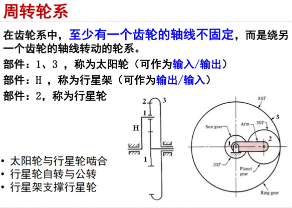	<!--高度设置-->
             
        

</td>    
     	<td>

	<!--第二张图片-->
    		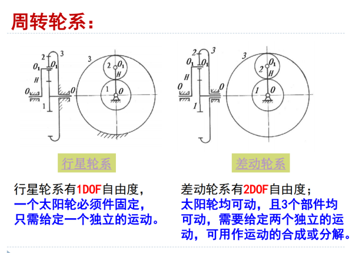	
             
        

</td>
	</tr>
</table>

11.连杆

①生活中的连杆机构：机械加工设备、公交车车门、火车车轮、缝纫机、起重器、机器人
②优点：可以设计出各种曲线轨迹；缺点：机械效率降低，不适宜高速运动(相对于齿轮而言)
③三个基本形式：**<u>曲柄摇杆机构、双曲柄机构、双摇杆机构</u>**；两个演化形式：**<u>曲柄滑块机构、平行四边形机构</u>**；

<table frame=void>	<!--用了
进行封装-->
	<tr>
        <td>

	<!--每个格子内是图片加标题-->
        	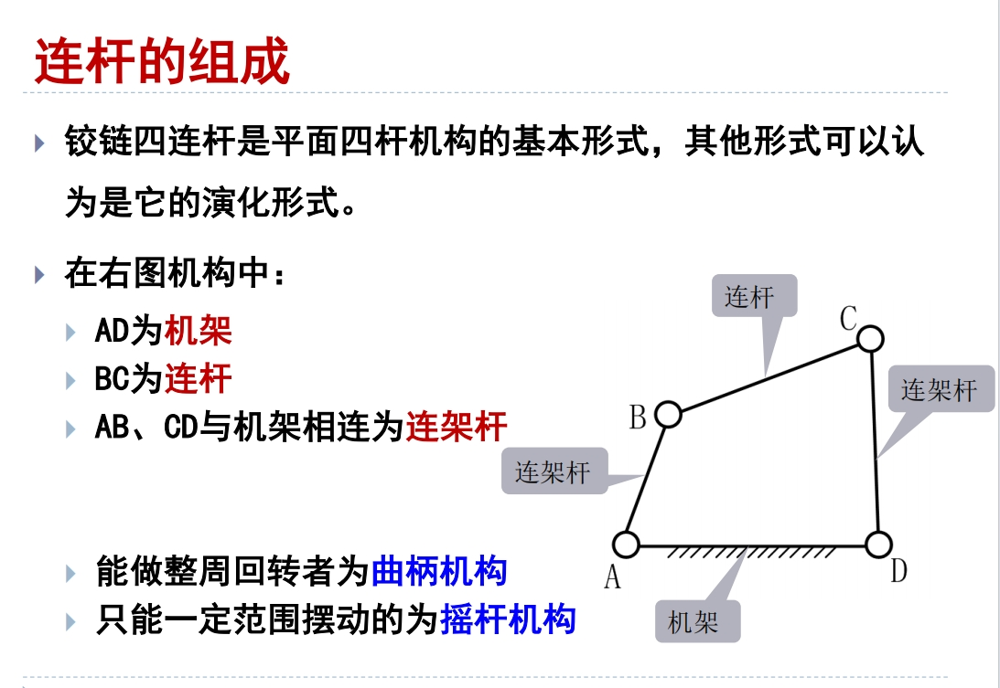	<!--高度设置-->
             
        

</td>    
     	<td>

	<!--第二张图片-->
    		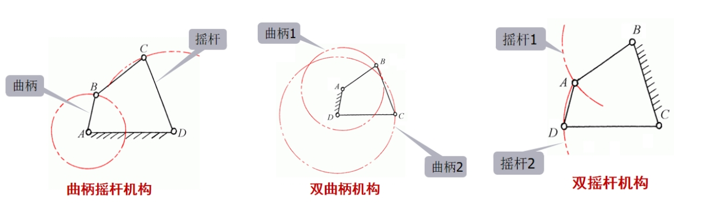	
             
        

</td>
	</tr>
</table>

④类型判断：如下图所示，平面四杆机构具有整转副→ 则可能存在曲柄
1）**<u>AB杆最短</u>**→曲柄摇杆机构
2）**<u>2杆最短</u>**→双摇杆机构
3）**<u>4杆最短</u>**→双曲柄机构

<table frame=void>
 <tr>
 <td>
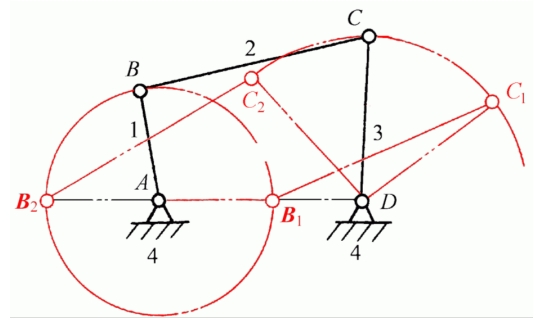
</td>
 </tr>
</table>

