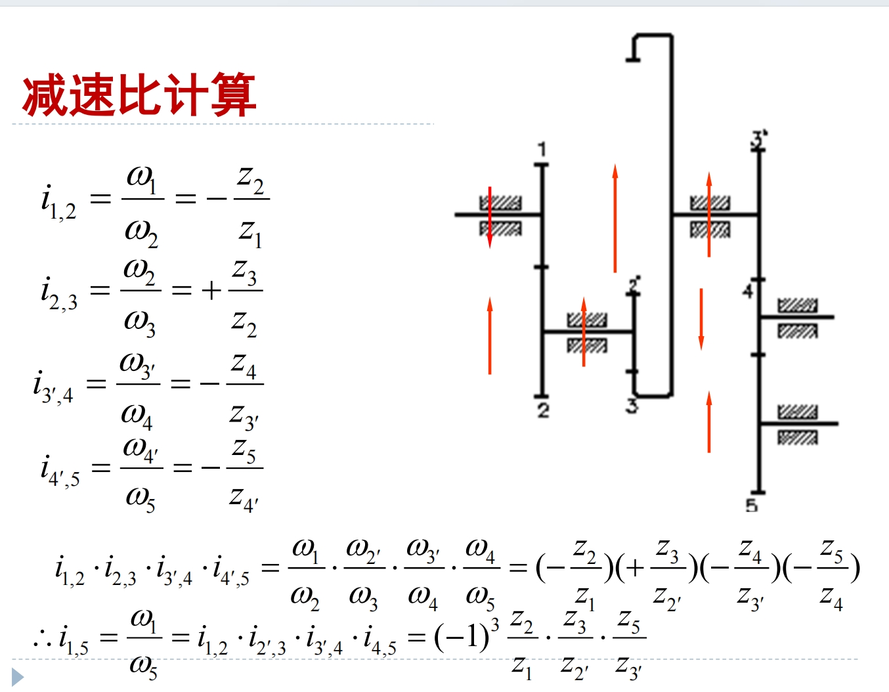

# 机器人与人工智能导论复习提纲

## 前言

​        《机器人与人工智能导论》是控制学院为机器人工程专业的同学们开设的一门专业基础课程。这门课主要分别由王酉老师、朱秋国老师、张建明老师讲解三个部分，内容较多且较为杂乱，需要记忆的东西较多。23-24春夏的考试周前，我整理了一篇《机器人与人工智能导论提纲与历年卷》，受到了很多同学的好评，也收到了许多建议。当时是使用word排版的，色彩过于丰富，不易识别重点，且结构相对混乱。且由于时间所限部分明确那年不考的内容没有整理。为了进一步方便同学们的复习与背诵，我于24-25秋冬的寒假重新整理成markdown的格式，希望能够在之后帮到机器人的一代代同学们！当然也有很多不足之处，还请多批评指正！在此感谢@博格达 对内容的进一步补充和完善，他完善了大量“小寄巧”并增添了许多内容，建立了github仓库，以及对我继续完成这篇整理的鼓励；也感谢@FrankG 的模版。历年卷部分来自各位前辈的回忆，也希望各位学弟学妹能够传递下去！

​          课程仓库：https://github.com/BGDabyss/CourseNotes_Intro2Robotics_AI.git **<u>欢迎大家点个star</u>**

​          需要提醒大家的是，这门课的最后，三位老师均会发给大家复习ppt，且每年可能有所变化，用以划定当年考试的范围（也就是说复习ppt以外的都不考），而本提纲整理了几乎所有课上ppt看上去很可能的内容，尤其是张建明老师的部分，挑重要的要考的记忆即可，因此请大家注意辨别，**<u>以当年发布的复习课ppt为准</u>**。预祝大家取得优异的成绩！

​                                                                                                                                                                                                     Colamentos
​                                                                                                                                                                                            2025.1.12于林海雪原

## Part 1 王酉老师部分

### Lesson 1:绪论

1.机器人从应用角度分为**<u>工业机器人</u>**（**<u>工业制造、工件运输</u>**）和**<u>服务机器人</u>**（**<u>军事侦察、微创手术、家庭清洁、外空探测</u>**）；机器人从运动角度分类：**<u>轮式、履带、足式</u>**等。

> *无人驾驶汽车：不能直接说是工业/服务机器人，得看运货还是运人

2.机器人的本质：机器人是一种**<u>人造</u>**的机器，具有**<u>人类</u>**的特性（两个维度：**<u>体能、智能</u>** 或**<u>能量、信息</u>**）

3.能量传递系统？信息传递系统？（可考简答，也是设计题的核心思想）

<div><table frame=void>	<!--用了<div>进行封装-->
	<tr>
        <td><div><center>	<!--每个格子内是图片加标题-->
        		<!--高度设置-->
            <br>
            能量传递系统
        </center></div></td>    
     	<td><div><center>	<!--第二张图片-->
    			
            <br>
            信息传递系统
        </center></div></td>
	</tr>
</table></div>
4.自主机器人的一般架构：

<table frame=void>
 <tr>
 <td><center></center></td>
 </tr>
</table>


### Lesson 2:嵌入式系统

5.冯诺依曼体系结构是指**<u>计算机的硬件组成结构</u>**。其主要组成部分如下（如果强调要画图，则必须要画图）

<table frame=void>
 <tr>
 <td><center></center></td>
 </tr>
</table>


6.Arduino 是一个能够用来**<u>感应</u>**和**<u>控制</u>**现实物理世界的一套工具，是一个打包后的**<u>平台</u>**（而非仅仅是芯片）
   ·两个函数：**<u>setup</u>**（初始化）和**<u>loop</u>**（循环）

> 小寄巧：
> **如何编写简单的Arduino程序**
> ~~加入浙江大学机器人协会，参与内训课程即可~~
> >1. 宏定义：引脚的编号不便记忆，用宏定义替换为方便记忆的名称。
> 常见宏名有：LED（led灯），LEFT（左轮），RIGHT（右轮）
> eg.将13号引脚记为led:
> #define LED 13
> 
> >2. setup函数：返回值类型为void（无返回值），只会在开始的时候运行一次（初始化）。
> 
> >3.  loop函数：同为void类型，会在setup（）之后不断循环进行，是Arduino程序的主函数。
>
> >4. pinMode函数：在setup()里需要设置输入输出引脚,格式为"pinMode(<引脚编号>,OUTPUT/INPUT);",其中引脚编号通常用宏替换。
> eg.设置LED引脚为输出引脚:
> pinMode(LED,OUTPUT);
>
> >5. digitalWrite函数：设置输出引脚的输出高/低电平，格式为"digitalWrite(<引脚编号>，HIGH/LOW);",其中引脚编号通常用宏替换。
> eg.设置LED输出高电平(即点亮led)
> digitalWrite(LED，HIGH);
>
> >6. delay函数：顾名思义，将上一个状态delay（延迟）一段时间再进入下一个状态。
> eg.维持led点亮1s
> digitalWrite(LED，HIGH);
>delay(1000);//注意delay的单位是ms
>
> >7. **注意：**Arduino语言遵循c语言语法，所以注意别忘了在语句结尾加分号！
> 
以下是一个例子，可以思考一下小车是怎么运动的
```c
// 设置电机控制引脚
#define motor1Pin1 3  // 左电机 IN1
#define motor1Pin2 4  // 左电机 IN2
#define motor2Pin1 5  // 右电机 IN3
#define motor2Pin2 6  // 右电机 IN4

void setup() {
  // 设置电机控制引脚为输出模式
  pinMode(motor1Pin1, OUTPUT);
  pinMode(motor1Pin2, OUTPUT);
  pinMode(motor2Pin1, OUTPUT);
  pinMode(motor2Pin2, OUTPUT);
}

void loop() {
  // 小车前进
  forward();
  delay(2000); // 前进 2 秒
  
  // 小车后退
  backward();
  delay(2000); // 后退 2 秒
  
  // 小车左转
  leftTurn();
  delay(2000); // 左转 2 秒
  
  // 小车右转
  rightTurn();
  delay(2000); // 右转 2 秒
}

// 小车前进
void forward() {
  digitalWrite(motor1Pin1, HIGH);  // 左电机前进
  digitalWrite(motor1Pin2, LOW);
  digitalWrite(motor2Pin1, HIGH);  // 右电机前进
  digitalWrite(motor2Pin2, LOW);
}

// 小车后退
void backward() {
  digitalWrite(motor1Pin1, LOW);   // 左电机后退
  digitalWrite(motor1Pin2, HIGH);
  digitalWrite(motor2Pin1, LOW);   // 右电机后退
  digitalWrite(motor2Pin2, HIGH);
}

// 小车左转
void leftTurn() {
  digitalWrite(motor1Pin1, LOW);   // 左电机后退
  digitalWrite(motor1Pin2, HIGH);
  digitalWrite(motor2Pin1, HIGH);  // 右电机前进
  digitalWrite(motor2Pin2, LOW);
}

// 小车右转
void rightTurn() {
  digitalWrite(motor1Pin1, HIGH);  // 左电机前进
  digitalWrite(motor1Pin2, LOW);
  digitalWrite(motor2Pin1, LOW);   // 右电机后退
  digitalWrite(motor2Pin2, HIGH);
}
```
答案是：
小车会先前进 2 秒。
然后后退 2 秒。
接着左转 2 秒。
最后右转 2 秒。

会读以后，你还要会写这个程序。

7.**<u>PWM脉宽调制</u>**：用改变电机电枢电压接通与断开的时间占空比来控制电机转速的方法

> 例：如何实现让LED灯不闪烁，但是亮度只有正常亮度的20%，请写出关键指令: 
>
> ​	digitalWrite(LED，HIGH);
>
> ​	delay(2);
>
> ​	digitalWrite(LED,LOW);
>
> ​	delay(8);

8.机器人控制方法举例：位置控制、速度控制、加速度控制、力控制、力位混合控制等

### Lesson 3:传感器

9.传感器的定义：用于**<u>定量</u>**感知环境**<u>特定物质属性</u>**的电子、机械、化学设备，并能够把各种**<u>物理量和化学量</u>**等精确地变换为**<u>电信号</u>**，再经由电子电路或计算机进行分析与处理，从而对这些量进行检测。

> *接近觉：**<u>人类所没有的功能</u>**
>
> *移动机器人的传感器，记住大体架构，需要会迁移

10.传感器分为**<u>内部</u>**和**<u>外部</u>**两大类；
①内部传感器控制测量机器人**<u>自身状态</u>**，常用于**<u>底层运动控制</u>**；
②外部传感器测量机器人**<u>所处环境</u>**，部分用于**<u>底层运动控制</u>**，部分用于**<u>上层运动规划</u>**。

<div><table frame=void>	<!--用了<div>进行封装-->
	<tr>
        <td><div><center>	<!--每个格子内是图片加标题-->
        		<!--高度设置-->
            <br>
            内部传感器
        </center></div></td>    
     	<td><div><center>	<!--第二张图片-->
    			
            <br>
            外部传感器
        </center></div></td>
	</tr>
</table></div>


> （1）电位器：
>
> ①原理：**<u>滑动片靠近或接触电阻丝取电信号，将位移转化为电阻变化，进而变成电流与电压的变化</u>**
> ②分类：旋转式（测量**<u>角位移</u>**）/直线式（测量**<u>线位移</u>**），测量**<u>绝对位置</u>**
> ③使用方式：单独使用/和其他传感器(如编码器)一起使用；
> 用**<u>电位器</u>**检测起始位置/用**<u>编码器</u>**检测关节和连杆的当前位置。
>
> 
>
> （2）速度传感器（编码器）：
>
> ①分类：根据测量介质分为光电码盘和磁编码器；根据测量结果分为绝对式和增量式
>
> <table frame=void>
> <tr>
> <td><center>                alt="None"
>                height="200"/></center></td>
> </tr>
> </table>
>
> ①光电码盘原理：**<u>切割光/磁，通过脉冲计数计算旋转角度</u>**
> ②利用编码器测量速度的两种方法（混合测速法）：
> （记周）测量相邻**<u>脉冲时间间隔</u>**，速度越**<u>慢</u>**越精确
> （记频）统计指定时间内**<u>脉冲信号数量</u>**，速度越**<u>快</u>**越精确
>
> 
>
> （3）加速度传感器：
>
> ①核心：$F=ma$
> ②原理：利用加速度造成某个介质**<u>产生变形</u>**，通过测量其**<u>变形量</u>**并用相关电路转化成**<u>电压</u>**输出
> ③举例：**<u>压电晶体</u>**
>
> 
>
> （4）方位角传感器
> ①作用：用于测量机器人的**<u>方向</u>**和**<u>倾角</u>**，可进行机器人位姿估计
> ②举例： 指南针（缺点：**易受其他磁性物质和人类环境的干扰**）、陀螺仪、倾角仪
>
> 
>
> （5）角速度传感器（陀螺仪）
>
> ①分类：机械陀螺仪、光纤陀螺仪
> ②MEMS陀螺仪：MEMS陀螺仪利用**<u>科里奥利力</u>**（旋转物体在径向运动时所受到的切向力），**<u>积分</u>**计算出角速度、角度等，即**<u>测量加速度（科里奥利力）->积分 ->获得角度</u>**，有**<u>三轴加速度、三轴角速度、三轴角度</u>**
>
> 
>
> （6）力觉传感器
>
> ①分类：压阻式（半导体压阻效应）、压电式（压电效应）、阻容式（电容机理）
>
> 
>
> （7）力矩传感器
>
> ①原理：当力矩作用在弹性轴上，轴会产生扭曲变形，存在剪切应变和应力
> ②应用：安装在关节驱动器上，用于测量驱动器输出的力和力矩，实现关节力控制；安装在末端执行器上，称腕力传感器；安装在手爪指关节上，称指力传感器。
> ③基于位置传感器和力力矩传感器的机器人控制：
>
> <table frame=void>
> <tr>
> <td><center>                alt="None"
>                height="220"/></center></td>
> </tr>
> </table>
>
> 
>
> （8）触觉传感器
> ①定义：测量解释接触觉、压觉或滑觉的传感器
> ②作用：确定接触的发生，提供接触的信息，如形状、尺寸和材质等。
>
> 
>
> （9）超声传感器
>
> ①原理：利用**<u>压电传感器</u>**生成声波，采用测量**<u>传输时间</u>**法测距
> ②模式：**<u>对置模式</u>**/**<u>回波模式</u>**
>
> 
>
> （10）激光传感器
>
> ①原理：同上
> ②主要测距方法：**<u>三角法</u>**、**<u>时飞法</u>**（TOF）、**<u>相位法</u>**
> 三角法：比较落后，位移转换为位移
> 时飞法（直接延迟时间测量法）：由于光速快，对时钟精度要求高→修正（**<u>间接相位时间测量法</u>**）：发射器发射一个连续波。用具有**<u>不同频率的sin信号</u>**调制所携带信号的波长。比较反射信号与所发送信号之间的**<u>相位差</u>**
> ③超声传感器和激光传感器区别/激光传感器为什么好：
> 问题1：**<u>声波速度慢，降低了感知速率；声波束按锥形方式传播,，空间分辨率低</u>**；
> 问题2：**<u>软的物体表面将吸收大部分声音能量，光滑的物体表面将形成镜面反射</u>**。
>
> 
>
> （11）视觉传感器
>
> ①原理：通过光学摄像机或红外、激光、超声、X射线对周围场景或物体进行探测成像

11.传感器的特性：分为**<u>静态特性</u>**和**<u>动态特性</u>**；前者要求<u>**输出相对于输入保持一定的对应关系**</u>；后者也叫<u>**响应特性**</u>，要检测的输入信号是**<u>随时间而变化</u>**的，则传感器应能跟踪输入信号的变化。

12.主要静态特性举例：灵敏度、信噪比、线性、时滞、稳定性、精度。

13.传感器的发展趋势：微小化、仿生化、柔性化、多信息融合

> 小寄巧：如何选择传感器？/xx机器人需要哪些传感器？
>思考机器人的用途，完成用途需要哪些信息，选择能获得对应信息的传感器
>Eg. 四旋翼无人机
>需要定位——GPS
>需要控制位姿——IMU
>拍摄用——摄像头
>测量飞行高度——（通过气压计算）气压传感器
>避障——激光雷达
>其他功能——（人机交互的触摸屏）触觉传感器，（录音）麦克风矩阵……
>**Note：由于无人机通常用于室外大范围移动，所以这里定位选择了GPS，若是室内定位则需要其他手段(如蓝牙、WIFI)，请具体分析。**

14.机器视觉：例如深度学习算法YOLO
应用：人脸识别、无人驾驶、医学图像诊断、产品质量识别

> 小寄巧：冯诺依曼框图怎么画？
>
> 包含两个维度：**信息与能量**	
> →信息：主要是输入（**传感器**等）、MCU（包括了**控制、运算、存储**）、输出（**执行机构**等等）	
> →能量：为整个系统供能，可以框起来写外面：电源；连线即表示电缆
>
> <table frame=void>
>  <tr>
>  <td><center>                   alt="None"
>                   height="220"/></center></td>
>  </tr>
></table>
>
>  **实际上非常套路化，记住大体框架即可**
> 
> <table frame=void>
>  <tr>
>  <td><center>                   alt="None"
>                   height="290"/></center></td>
>  </tr>
> </table>

## Part 2 朱秋国老师部分

### Lesson 4:机器人驱动原理概述

1.机器人的主要特征：感知、决策、运动、交互。

2.驱动方式

（1）电机驱动：
①优点：控制调节简单、稳定性较好；
②缺点：力矩小、刚度低，常常需要配合减速器使用。
③电机驱动最常用的驱动方式是**<u>有刷电机H桥驱动</u>**，其中4个二极管的作用是**<u>防止反向电压</u>**，直流有刷电机控制A、B两相的输入：
A为正，B为负的时候，电机进行正转；
A为负，B为正的时候，电机进行反转；A、B都为正的时候，电机停止转动；
④L298芯片是双H桥驱动器，可以驱动两个直流电机。
⑤基本控制方式有：开环伺服系统、闭环伺服系统和半闭环伺服系统。
⑥直流电机可以输出**<u>力矩和速度</u>**，如小车的直线运动、转弯等；舵机用于**<u>角度、位置</u>**伺服，如机械手转动；PWM波（占空比可变的方波）控制。
→直流有刷电机由**<u>磁极、电枢绕组、电刷和换向片</u>**组成。
→无刷直流电机由**<u>电机本体、位置传感器、电子换向电路</u>**三大部分组成。
	1）电机主体由**<u>主定子、主转子</u>**组成。主转子是永久磁铁，主定子是电枢。
	2）一般而言，无刷电机的绕组有**<u>星形联结</u>**方式和**<u>三角联结</u>**方式，而三相星形联结（Y型）的**<u>二二导通方式</u>**最为常见。
	3）位置传感器包括光电编码器、霍尔传感器；一般在电机的不同位置上装**<u>三个霍尔传感器</u>**，就可测出转子的位置。

<div><table frame=void>	<!--用了<div>进行封装-->
	<tr>
        <td><div><center>	<!--每个格子内是图片加标题-->
        		<!--高度设置-->
            <br>
            以三相3绕组2极（1对极）为例
        </center></div></td>    
     	<td><div><center>	<!--第二张图片-->
    			
            <br>
            换相只与转子位置有关，与速度无关
        </center></div></td>
	</tr>
</table></div>


​         采用9绕组6极，而不是6绕组6极原因：为了防止定子的齿与转子的磁钢相吸而对齐，产生类似步进电机的效果，此情况下转矩会产生很大波动。

⑦三个重要物理量：电枢电动势$E_a$、电磁转矩$T$和电磁功率$P$；**转速与感应电动势成正比**，**力矩与电流大小成正比**。
$$
E_a=K_en\\
T=K_mI\\
P=E_a \cdot I=T\cdot\omega
$$
→检查电机是否烧坏，可以通过测量电机绕阻的值是否正常来判断。
→斜率(速度/转矩常数)越小，说明电机的刚性越好，越“硬”。斜率是电机本身决定的，与端电压和速度无关。

⑧负载的转动惯量折合到主动轴上时，从动轴上的转动惯量和阻尼系数都要除于传动比的平方，负载转矩除于传动比。⑨脉冲宽度调制（PWM）：**<u>用改变电机电枢电压接通与断开的时间占空比来控制电机转速的方法</u>**。
$$
v_d=v_{max}\cdot D
\\其中D为占空比，即下图中的\frac{t_1}{T}
$$

<table frame=void>
 <tr>
 <td><center></center></td>
 </tr>
</table>

（2）气压驱动：
①优点：气源获得方便、成本低、动作快；
②缺点：输出功率小，体积大。一般而言，其工作噪声较大、控制精度较差；
③组成：气缸、气阀、管路。
④**气动驱动系统**包括：**<u>气压发生装置、辅助元件、控制元件和执行元件</u>**，方向控制回路包括单作用气缸换向回路 、双作用气缸换向回路

<div><table frame=void>	<!--用了<div>进行封装-->
	<tr>
        <td><div><center>	<!--每个格子内是图片加标题-->
        		<!--高度设置-->
            <br>
        </center></div></td>    
     	<td><div><center>	<!--第二张图片-->
    			
            <br>
        </center></div></td>
	</tr>
</table></div>


> 小寄巧：
>
> **Q:判断是单作用还是双作用？**
>
> 1.本质：活塞一端自由、一端连通路→单作用；两端均连通路→双作用
> 2.直接看活塞有没有弹簧，有弹簧则为单，反之为双
> 3.三通一般是单，四通、五通一般是双
>
>  
>
> **Q:判断几位几通（重要）？**
>
> 位（位置状态）：有几个形如的块，就有几位
> 通：取任意一个如上所示的块，有一个箭头加2通，一个小“T”加1通

（3）液压驱动：
①优点：重量轻、尺寸小、动作平稳、快速性好、产生的力/力矩非常大；
②缺点：易漏油、维护困难；不确定性和非线性因素多，控制和校正不如电气式方便；
③组成：液压缸、液压马达、阀
④液压驱动系统包括：液压源、伺服阀、传感器、执行机构；原理：根据Pascal’s LAW， 液压压力可以成倍增大

<table frame=void>
 <tr>
 <td><center></center></td>
 </tr>
</table>

（4）新型驱动（如形状记忆合金→软体机器人）
磁流变液、基于介质电致变形的软体机器、气动软体机器人

3.模拟舵机（闭环控制）

①原理图

<table frame=void>
 <tr>
 <td><center></center></td>
 </tr>
</table>

②标准舵机有三条控制线，分别为电源线、地线和控制线。控制线连接到控制芯片上。
③舵机转动角度由**<u>PWM（脉冲宽度调制）信号的占空比</u>**来实现；PWM周期为20ms，脉宽分布在0.5～2.5ms之间；不同脉宽对应不同转角位置（以180°为例：0.5ms= -90°；1.5ms = 0°；2.5ms= 90°）。
④电机+减速器：改变运动速度、改变运动力量、改变运动方向

### Lesson 5:机器人设计与传动

4.在传动机构中，由旋转运动变成直线运动的机构举例：**<u>齿轮齿条、曲柄滑块、凸轮、皮带、螺丝、滚珠丝杠、链条</u>**

5.机器人机构三部分：**<u>执行机构、传动机构、支撑/导向机构</u>**

> 传动机构的性能要求
>
> 1、转动惯量：尽量小。
> 2、刚度：伺服系统动力损失小。
> 3、阻尼：共振区域阻尼越大越好;远离共振区域阻尼越小越好。
> 其他要求：摩擦小、抗振性好、传动间隙小等。

6.减速比：也即**<u>传动比</u>**。指减速机构**<u>输入速度</u>**与**<u>输出速度</u>**之比，用“i”表示。即，**<u>i =输入速度/输出速度</u>**，并使**<u>输出力/力矩变为原来的i倍</u>**

> *减速机构作用：①**<u>减小速度</u>**②**<u>增大力矩</u>**
>
> 例：电机输入减速箱的速度1000n/min，输出速度10n/min，则减速比 i =1000/10=100
> 如电机输出力矩为$T_{in}$=0.1Nm，则输出力矩为$T_{out}=i\cdot T_{in}$=0.1Nm*100=10Nm

7.刚体的自由度：刚体本身具有可独立运动方向的数目。若$l$为连杆数（包括基座），$n$为关节总数，$f_i$为第$i$个关节的自由度数：
$$
F=6(l-n-1)+\sum\limits^n_{i=1}f_i
$$
对于平面机构。其自由物体是三个自由度，上述公式中6改为3，即
$$
F=3(l-n-1)+\sum\limits^n_{i=1}f_i
$$
8.齿轮

①优点：传动比较准确，效率高，结构紧凑，工作可靠，寿命长。
②模数$m$：$p_i/\pi$ （模数越大，齿厚就越大，齿轮的承载能力就越高；**<u>欲使两齿轮正确啮合，两轮的模数必须相等</u>**）
③分度圆：规定分度圆上的<u>**模数和压力角**</u>为标准值；分度圆又称节圆；国标压力角的标准值为**<u>20°</u>**；**<u>分度圆直径$d=mz$</u>**
④定常传动比：对齿轮传动的基本要求是保证瞬时传动比$i_{12}=\frac{\omega_1}{\omega_2}=const$；

9.齿轮轮系

①传动比：
$$
i_{首末}=\frac{\omega_首}{\omega_末}=\frac{z_末}{z_首}
$$
②转向关系：外啮合（**<u>方向相反</u>**），内啮合（<u>**方向相同**</u>）

<table frame=void>
 <tr>
 <td><center></center></td>
 </tr>
</table>

> 小寄巧
>
> **Q:判断旋转方向的传导？**
>
> 严格竖直同一列的转动方向相反，否则方向相同。
>
> **<u>Q:计算减速比？</u>**
>
> ①减速比一定大于1
> ②1到2的减速比即为“齿数2/齿数1”，同向取正，反向取负；
> ③多个齿轮拼接，当没有出现“同一轴上有两个齿轮的情况”，减速比直接相乘，即为“最后一个齿轮的齿数/第一个齿轮的齿数”，同向取正，反向取负；
>
> 例如上图中的从左到右数第二个齿轮，此处2齿轮同轴有两个齿轮，因此$z_2$与$z_2'$是两个不同的齿数，无法直接约分；3齿轮同理：
>
> <table frame=void>
>  <tr>
>  <td><center>                   alt="None"
>                   height="380"/></center></td>
>  </tr>
> </table>

10.周转轮系：

<div><table frame=void>	<!--用了<div>进行封装-->
	<tr>
        <td><div><center>	<!--每个格子内是图片加标题-->
        		<!--高度设置-->
            <br>
        </center></div></td>    
     	<td><div><center>	<!--第二张图片-->
    			
            <br>
        </center></div></td>
	</tr>
</table></div>

11.连杆

①生活中的连杆机构：机械加工设备、公交车车门、火车车轮、缝纫机、起重器、机器人
②优点：可以设计出各种曲线轨迹；缺点：机械效率降低，不适宜高速运动(相对于齿轮而言)
③三个基本形式：**<u>曲柄摇杆机构、双曲柄机构、双摇杆机构</u>**；两个演化形式：**<u>曲柄滑块机构、平行四边形机构</u>**；

<div><table frame=void>	<!--用了<div>进行封装-->
	<tr>
        <td><div><center>	<!--每个格子内是图片加标题-->
        		<!--高度设置-->
            <br>
        </center></div></td>    
     	<td><div><center>	<!--第二张图片-->
    			
            <br>
        </center></div></td>
	</tr>
</table></div>
④类型判断：如下图所示，平面四杆机构具有整转副→ 则可能存在曲柄
1）**<u>AB杆最短</u>**→曲柄摇杆机构
2）**<u>2杆最短</u>**→双摇杆机构
3）**<u>4杆最短</u>**→双曲柄机构


<table frame=void>
 <tr>
 <td><center></center></td>
 </tr>
</table>
12.轴承
①轴承的分类：径向接触轴承、轴向接触轴承、向心角接触轴承
②轴承的安装与固定：
      1）目的：通过轴承与轴和轴承座间的联接固定，使轴系在机器中有确定位置。
      2）要求：使轴上的载荷能可靠地传到机架上去，防止轴沿轴向串动。受热膨胀时，轴能自由伸缩
      3）方法：两端固定支承（最常用）：通过两个轴承共同限制轴的双向串动。其中，轴承1限制轴一个方向的串动2，轴承2限制反方向的串动。
      4）深沟球轴承应留热补偿间隙 Δ＝0.25～0.4mm；特点：结构简单，安装调整容易，适用于温度变化不大的短轴。

13.滑轮组
①固定轮只能用于改变力的方向，而运动轮可以降低输入力量的大小。
②通过动滑轮，可以实现两倍的运动距离，但是需要的力矩需要增加一倍。

14.带传动（主要用于传递功率较大而结构要求紧凑的场合，传动比可达10，带速可达40m/s。）
①平带传动：在传动中心距较大时应用较多，以帆布芯平带应用最广
②V型带传动：应用最广，能产生更大摩擦力
③多楔带传动：兼有平带和V带的优点，柔性好、摩擦力大，能传递的功率大。

15.链传动
①概念：链传动是依靠链齿轮齿与链节的啮合来传递运动和动力，但在运转时不能保证瞬时传动比。
②优点：可以应用在不宜采用齿轮传动的场合，比如自行车、摩托车。还可用在低速重型及极为恶劣的工作条件下，比如应用在掘土机的运行机构。

16.同步带
同步带传动综合了带传动和链传动的优点。

17.蜗杆传动
①概念：蜗杆传动由蜗杆、涡轮组成，是在空间交错的两轴间传递运动和动力的一种传动机构，两轴交错的夹角常用的是90°
②优点：传动比大，结构紧凑。传动平稳，噪声小。具有自锁性。

### Lesson 6:机器人运动学

18.运动学是指机器人连杆的**<u>位置</u>**和**<u>姿态</u>**（位姿）与关节角度关系的理论，运只研究物体的运动而不考虑引起（或影响）这种运动的力。

19.正运动学：已知**<u>关节角</u>**，求**<u>连杆末端的位姿</u>**

20.逆运动学：已知**<u>连杆末端的位姿</u>**，求**<u>关节角度</u>**；求解方法有数值方法（需迭代，实时性差，通用性好）和解析方法（无需迭代，实时性好，通用性差）。

> *正运动学一般用于检验逆运动学是否正确，逆运动学的难度高于正运动学

21.坐标变换的方法：

<div><table frame=void>	<!--用了<div>进行封装-->
	<tr>
        <td><div><center>	<!--每个格子内是图片加标题-->
        		<!--高度设置-->
            <br>
        </center></div></td>    
     	<td><div><center>	<!--第二张图片-->
    			
            <br>
        </center></div></td>
	</tr>
</table></div>

22.转动特性：最基本的转动是绕x ,y和z轴的旋转运动，分别称为**<u>滚动</u>**（roll）、<u>**俯仰**</u>（pitch）和**<u>偏摆</u>**（yaw）

<table frame=void>
 <tr>
 <td><center></center></td>
 </tr>
</table>

## Part 3 张建明老师部分

### Lesson 7:人工智能——知识表示与推理

#### 一、知识与知识表示的概念

1.知识表示（knowledge representation）：将人类知识**<u>形式化</u>**或者**<u>模型化</u>**。
选择知识表示方法的原则：①充分表示领域知识。 ②有利于对知识的利用。③便于对知识的组织、维护与管理。 ④便于理解与实现。

 

#### 二、一阶谓词逻辑表示法

1.命题（proposition）：**<u>一个非真即假的陈述句</u>**。

2.命题逻辑：研究命题及命题之间关系的**<u>符号逻辑系统</u>**。

3.命题逻辑表示法：无法把它所描述的事物的结构及逻辑特征反映出来，也不能把不同事物间的共同特征表述出来。

4.谓词的一般形式：**<u>$P(x_1,x_2...x_n)$</u>**
（1）个体$x_1,x_2...x_n$：某个独立存在的事物或者某个抽象的概念；

> *可以是常量、变量（范围）、函数、谓词

（2）谓词名 P：刻画个体的性质、状态或个体间的关系。

5.谓词公式：

（1）连接词
①﹁否定“非”  ②∨析取“或”  ③∧合取“与”  ④→蕴含/条件   ⑤↔等价/双条件

> e.g.
> ﹁ Inroom (robot, r2)
> Plays (Liming, basketball) ∨ Plays (Liming, football)
> Like (I, music) ∧ Like (I, painting)
> RUNS (Liuhua，faster)→WINS (Liuhua ，champion)

（2）量词

①全称量词（universal quantifier）$(\forall x)$ ②存在量词（universal quantifier）$(\exist x)$

> e.g.
> $(\forall x)$[ROBOT (x) → COLOR (x，GRAY)]
> $(\exist x)$INROOM（x，r1）
>
> 另外，全称量词和存在量词的次序也将影响命题的意思，例如：
>
> $(\forall x)$$(\exist y)$[Employee (x) →Manager (y,x)] 
>  “每个雇员都有一个经理”       
>
> $(\exist y)$$(\forall x)$[Employee (x) →Manager (y,x)]
>  “有一个人是所有人的经理”   

（3）性质

①如果谓词公式P对个体域D上的任何一个解释都取得真值T，则称P在D上是永真的；如果P在每个非空个体域上均永真，则称P永真。
②如果谓词公式P对个体域D上的任何一个解释都取得真值F，则称P在D上是永假的；如果P在每个非空个体域上均永假，则称P永假。
③对于谓词公式P，如果至少存在一个解释使得P在此解释下的真值为T，则称P是可满足的，否则，则称P是不可满足的。

#### 三、产生式表示法

1.产生式：

<table frame=void>
 <tr>
 <td><center></center></td>
 </tr>
</table>

（1）确定性规则知识：IF P THEN Q 或 P→Q 
（2）不确定性规则知识：IF P THEN Q （置信度） 或 P→Q （置信度）
（3）确定性事实性知识：三元组表示**<u>（对象，属性，值）</u>**或**<u>（关系，对象1，对象2）</u>** 
（4）不确定性事实性知识：四元组表示：**<u>（对象，属性，值，置信度）</u>**或**<u>（关系，对象1，对象2，置信度）</u>**

 

2.产生式系统：
（1）规则库：用于描述**<u>相应领域内知识</u>**的<u>产生式集合</u>
（2）综合数据库(事实库、上下文、黑板等)：一个用于存放问题求解过程中**<u>各种当前信息</u>**的数据结构。
（3）控制系统（推理机构）：由**<u>一组程序</u>**组成，负责**<u>整个产生式系统的运行</u>**，实现对问题的求解

3.框架：一种描述所论**<u>对象（一个事物、事件或概念）属性</u>**的数据结构。、

> *一个框架由若干个被称为“槽”（slot）的结构组成，每一个槽又可根据实际情况划分为若干个“侧面”（faced）。一个槽用于描述所论对象某一方面的属性。一个侧面用于描述相应属性的一个方面。槽和侧面所具有的属性值分别被称为槽值和侧面值。

4.语义网络表示法：
（1）语义网络是一种采用**<u>网络形式</u>**表示人类知识的方法。
（2）结点一般划分为**<u>实例结点</u>**和**<u>类结点</u>**两种类型。结点之间带有标识的**<u>有向弧</u>**表示结点之间的语义联系，是**<u>语义网络组织知识的关键</u>**。 

<table frame=void>
 <tr>
 <td><center></center></td>
 </tr>
</table>

### **Lesson 8:人工智能——问题求解**

#### 一、问题求解的步骤

Step1 **<u>形式化</u>**（问题的表示）①目标形式化②问题形式化
Step2 **<u>搜索</u>**：检验那些可能到达具有已知评价的状态的动作序列，然后选择最佳序列。
Step3 **<u>执行</u>**：将问题的解付诸行动

#### 二、搜索策略

1.搜索方向
（1）数据驱动：从初始状态出发的**<u>正向</u>**搜索。 
（2）目的驱动：从目的状态出发的**<u>逆向</u>**搜索。
（3）双向搜索 

2.搜索策略（盲目、启发、局部）
（1）盲目搜索：在不具有对特定问题的任何有关信息的条件下，按**<u>固定的步骤</u>**（依次或随机调用操作算子）进行的搜索。
→深度优先搜索策略：属于盲目搜索，当搜索到某一个状态时，它所有的子状态以及子状态的后裔状态都必须先于该状态的兄弟状态被搜索（找到解的策略：**<u>有限深度、迭代加深</u>**）
→宽度优先搜索策略：属于盲目搜索，首先扩展未被扩展的节点中最浅的那个
→代价一致搜索：是宽度优先搜索算法的引伸，扩展路径消耗最低的节点

> *代价一致搜索有可能陷入无限循环；如果规定每一步的耗散都大等于某个小的正值常数，那么就能保证完备性和最优性；代价一致搜索由路径的耗散引导不是由深度引导，其复杂度与b和最优解的耗散值有关。
>
> *一般来说，当搜索空间很大且解的深度未知时，**<u>迭代加深搜索</u>**是首选的盲目搜索方法！

|  评判标准  | 广度优先BFS | 深度优先DFS |      有限深度DLS      | 迭代加深IDS |
| :--------: | :---------: | :---------: | :-------------------: | :---------: |
|  完备性？  |     Yes     |     No      | Yes if $l\geqslant d$ |     Yes     |
| 时间复杂度 |   O(bd+1)   |    O(bm)    |         O(bl)         |    O(bd)    |
| 空间复杂度 |   O(bd+1)   |    O(bm)    |         O(bl)         |    O(bd)    |
|  最优性？  |   No/Yes    |     No      |          No           |   No/Yes    |

（2）启发式搜索：考虑特定问题领域可应用的知识，**<u>动态地</u>**确定调用操作算子的步骤，优先选择**<u>较适合</u>**的操作算子，**<u>尽量减少不必要的搜索</u>**，以求尽快地到达结束状态。
①启发信息：在具体求解中，能够利用与该问题有关的信息来简化搜索过程，称此类信息为启发信息；
②启发式搜索：利用启发信息的搜索过程。	
③估价函数f(n)：从初始结点经过结点到达目的n结点的路径的最小代价估计值，其一般形式是**<u>f(n)=g(n)+h(n)</u>**

> *一般地，在f(n) 中，g(n)的比重越大，越倾向于宽度优先搜索方式，而h(n)的比重越大，表示启发性能越强。

④启发式图搜索法的基本特点：**<u>如何寻找并设计一个与问题有关的h(n)及构出f(n)=g(n)+h(n)，  然后以f(n)的大小来排列待扩展状态的次序</u>**，每次选择f(n)值**<u>最小</u>**者进行扩展。
⑤ open表：保留所有已生成而未扩展的状态；closed表：记录已扩展过的状态。

→A\*搜索算法：如果某一问题有解，那么利用A*搜索算法对该问题进行搜索则一定能搜索到解，并且一定能搜索到最优的解而结束。

<table frame=void>
 <tr>
 <td><center></center></td>
 </tr>
</table>

（3）局部搜索算法
从单独的一个当前状态出发，通常只移动到与之相邻的**<u>状态</u>**，**<u>并且不保留解的路径</u>**。
①优点：需要**<u>很少的内存</u>**，经常能在很大或无限的状态空间中找到合理的解
②举例：**<u>爬山法</u>**搜索、**<u>模拟退火搜索</u>**、<u>**遗传算法**</u>

### Lesson 9:人工智能——机器学习

#### 一、学习和机器学习的概念

1.学习：**<u>一个有特定目的的知识获取过程</u>**。
（1）学习的内在行为：获取知识、积累经验、发现规律。
（2）学习的外部表现：改进性能、适应环境、实现系统的自我完善。

2.机器学习：**<u>计算机模拟人的学习行为，自动地通过学习获取知识和技能，不断改善性能，实现自我完善。</u>** 
（1）学习机理：对学习机制的研究，即人类获取知识、技能和抽象概念的天赋能力。 
（2）学习方法：在生物学习机理进行简化的基础上，用计算的方法进行再现
（3）学习系统：根据特定任务要求，建立相应的学习系统

3.机器学习系统
（1）学习系统：能够在一定程度上实现机器学习的系统。
（2）基本模型：

<table frame=void>
 <tr>
 <td><center></center></td>
 </tr>
</table>

#### 二、机器学习分类

（1）按学习方法分类（温斯顿，1977）：
机械式学习、指导式学习、示例学习、类比学习、解释学习等
（2）按学习能力分类：
监督学习（有教师学习）再励学习（强化学习或增强学习）非监督学习（无教师学习）
（3）按推理方式分类：
基于演绎的学习（解释学习）基于归纳的学习 （示例学习、发现学习等 ）
（4）按综合属性分类：
归纳学习、分析学习、连接学习

> ①机械式学习（rote learning）又称记忆学习，或死记式学习：通过**<u>直接记忆</u>**或者**<u>存储</u>**外部环境所提供的信息达到学习的目的，并在以后通过对知识库的检索得到相应的知识直接用来求解问题。 （理解：**<u>死记硬背而不理解</u>**）
>
> ②指导式学习（learning by being told）又称嘱咐式学习或教授式学习：由外部环境向系统提供**<u>一般性的指示或建议</u>**，系统把它们具体地转化为细节知识并送入**<u>知识库</u>**中。在学习过程中要反复对形成的知识进行**<u>评价</u>**，使其不断完善。
>
> ③归纳学习：
>
> ·归纳推理：应用**<u>归纳方法</u>**所进行的推理，即从**<u>足够多的事例</u>**中归纳出<u>一般性</u>的知识。
> 1)它是一种**<u>从个别到一般、从部分到整体</u>**的推理。
> 2)归纳推理的重要特征：归纳出的结论**<u>不能绝对保证它的正确性</u>**，只能以某种程度相信它为真。
>
> ·示例学习**：又称为实例学习或从例子中学习：通过从环境中取得若干与某概念有关的例子，经归纳得出**一般性概念**的一种学习方法。
>
> ·观察与发现学习：
> 1)观察学习：用于对事例进行**<u>概念聚类</u>**，形成概念描述。
> 2)发现学习：用于发现规律，产生**<u>定律或规则</u>**。 
>
> ④属性类比学习：根据两个相似事物的属性实现类比学习的。
>
> ⑤转换类比学习：“状态”：描述问题在不同时刻的状况；“算符”：描述改变状态的操作；当问题由初始状态变换到目标状态时，所用算符的序列就构成了问题的一个解。
> ·类比推理：由新情况与记忆中的已知情况在某些方面相似，从而推出它们在其他相关方面也相似。
> · 类比推理的目的：从S中选出与当前问题最近似的问题及其求解方法来求解当前的问题，或者建立起目标域中已有命题间的联系，形成新知识。
>
> ⑥解释学习： 解释学习（explanation-based learning）：**<u>演绎学习方法</u>**。它是通过运用**<u>相关的领域知识</u>**，对当前提供的单个问题求解实例进行分析，从而构造解释并产生相应知识的。：通过运用相关的领域知识及一个训练实例来对某一目标概念进行学习，并最终生成这个目标概念的一般性描述。

<table frame=void>
 <tr>
 <td><center></center></td>
 </tr>
</table>

### Lesson 10:人工智能——智能体与多智能体系统

#### 一、智能体

1.智能体：指**<u>能够感知和动作的实体</u>**（任何独立的能够思想并可以同环境交互的实体都可以抽象为智能体）简单说，一个智能体就是**<u>从感知序列到动作</u>**的一个**<u>函数</u>**

2.智能体通过**<u>传感器</u>**感知所处环境并通过**<u>执行器</u>**对该环境产生作用

3.智能体的结构：**<u>智能体＝体系结构＋程序</u>**

> **体系结构为程序提供：**
> 来自传感器的感知信息
> 运行程序
> 把程序产生的行动送到执行器
>
> **四种基本的智能体类型**：
> 简单反射型
> 基于模型的简单反射型
> 基于目标
> 基于效用

4.学习智能体组件：**<u>①学习元件②执行元件③评论元件④问题产生器</u>**

 

#### 二、多智能体系统（协调、协作、协商）

> 省流：
>
> 协商协议主要处理协商过程中智能体之间的交互；
> 协商策略主要涉及智能体内的决策和控制过程；
> 协商处理侧重于对单个智能体和多个智能体协商社会的整体协商行为的描述和分析。

1.特点：多智能体系统（MAS）中每个智能体都具有独立性和自主性；MAS支持分布式应用，具有良好的模块性；**<u>协调、集成、高效率</u>**、各个智能体可以异构，可解决单一专家系统难以解决的问题

2.基本类型：<u>BDI模型、协商模型、协作规划模型、自协调模型</u>

3.体系结构：<u>网络结构、联盟结构、黑板结构</u>

4.协调
（1）地位：一个系统智能水平的重要体现
（2）概念：<u>**是一组智能体完成集体活动时相互作用的性质**</u>
（3）目的：避免智能体之间的死锁或活锁

> *死锁指多个智能体无法进行各自的下一步动作，活锁指多个智能体不断工作却无任何进展

（4）方法：①基于集中规划的协调②基于协商的协调③基于对策论的协调④基于社会规划的协调

5.协作
（1）类型：<u>完全协作型、协作型、自私型、完全自私型、协作与自私共存型</u>
（2）方法：
①<u>合同网协作方法</u>（最著名、应用最广）：人们在商务过程中用于管理商品和服务的合同机制；所有智能体分为两种角色：管理者和工作者
②<u>黑板模型协作方法</u>：构成：知识源（相互独立的专家智能体）、黑板（共享的问题求解工作空间）、监控机制
③市场协作协作方法：市场机制方法的基本思想是针对分布式资源分配的特定问题，建立相应的计算经济，以使智能体之间通过最少的直接通信来协调多个智能体之间的活动。所有智能体分为两种角色：生产者和消费者

6.协商
可概括为**<u>协商协议、协商策略和协商处理</u>**
（1）协商协议：用于处理协商过程中<u>协商主体之间的交互和作用</u>，是交易双方交互的规则
①主要研究的内容是智能体通信语言的定义、表示、处理和语义解释
②协商协议的形式化表示通常有三种方法：巴科斯范式表示、有限自动机表示和语义表示；巴科斯范式表示具有简洁、明了的特点，是最常用的方法
③根据<u>协商对象的数量</u>分为一对一、一对多、多对多的协议；根据<u>协商的顺序</u>分为轮流出价、同时出价协商协议；根据<u>协商议题的数量</u>分为单属性和多属性协商等

（2）协商策略：是智能体选择<u>协商协议和通信消息</u>的策略
①分类：单方让步策略、竞争型策略、协作型策略、破坏协商策略和拖延协商策略。主要是<u>竞争型和协作型策略</u>
②竞争型策略是指协商参与者在协商过程中表现出<u>竞争行为</u>，使协商结果向有利于自身利益方向发展的协商对策。合同网协调模型、劳资协商、基于对策论的协商过程等都属于此类
③协作型策略是指协商各方都从<u>整体利益</u>出发，在协商过程中互相合作，采取的协商策略有利于互相能接受的协商结果

> *策略选择的通用方法：依据影响协商的多方面因素，给出适宜的策略选择函数

（3）协商处理：对单个协商方及协商系统、协商行为的<u>描述及分析</u>，包括协商算法和系统分析两部分
①协商算法用于描述智能体在协商过程中的行为，包括通信、决策、规划和知识库操作等
②系统分析的任务是分析和评价智能体协商的行为和性能，回答协商过程中的问题求解质量、算法效率，以及系统的公平性和死锁等问题
